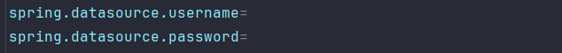
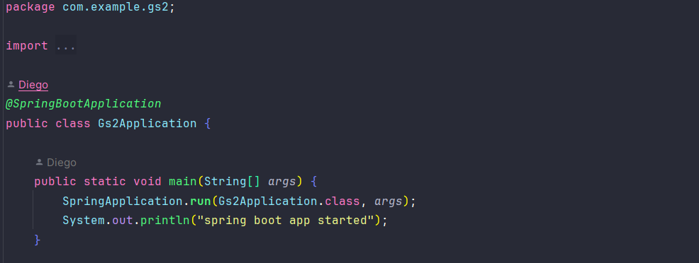

# Easy Toy
## Descrição

Projeto de desenvolvimento com Spring para uma plataforma de conteudos de energia sustentavel.

## Integrantes

- MATHEUS MATOS - RM:99792
- KAREN VITORIA JESUS DA SILVA - RM:99468
- JULIANNY ARAUJO PEREIRA - RM:99554
- DIEGO HENRIQUE SANTOS DE OLIVEIRA - RM:550269
- JULIA DE FATIMA QUEIROZ - RM:551130

## Modelo de Dados

**TB_GS2_APP_USER**
- id (chave primária)
- username
- password 

**TB_GS2_CONTEUDO**
- id (chave primária)
- nome_conteudo
- corpo 

**TB_GS2_MODULO**
- id (chave primária)
- nome_modulo
- descricao 

## How to use
- Configure o arquivo `application.properties` com as configurações do seu banco de dados.
  

- Execute a classe `Gs2Application.java` para iniciar a aplicação.
  

- Acesse o endereço `http://localhost:8080/` para acessar a aplicação.
- Após isso, realize o login ou se registre para acessar os conteudos.

## Nome da Aplicação
Easy Eco